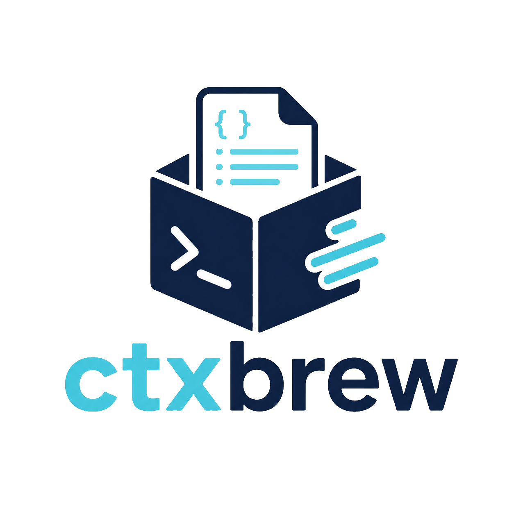

<p align="center">
  
</p>

<p align="center">
  <strong>Ship & Use AI-friendly package context.</strong>
</p>

`ctxbrew` is a CLI and protocol for shipping and consuming AI-friendly library context.

It helps:

- library authors ship context with minimal effort and configuration
- library users get better AI responses to prompts related to their dependencies.

## ✨ Features

- 🧑‍💻 **Simple authoring**: define a `ctxbrew.yaml`, build context artifacts, and publish them with your package.
- 🤖 **Simple consumption**: install `ctxbrew`, generate an agent skill, and let the LLM discover context from installed libraries.
- 📦 **No extra hosting**: ship context as part of your library.
- 🏷️ **Version correctness**: read context from the installed package version.
- ⚡ **Fast local access**: extract context from local package files with no network calls.
- 🪄 **Token efficiency**: split context into focused slices and compress supported sources into top-level signatures.

## 🚀 Quick Start

### 🧑‍🍳 Library Author Workflow

1. Install `ctxbrew` and create a config:

```bash
npm install ctxbrew --save-dev
npx ctxbrew init
```

This creates `ctxbrew.yaml`.

2. Edit `ctxbrew.yaml` and describe context slices.

Each slice may cover one focused feature, workflow, or concept. Smaller slices help agents request only the context they need and keep token usage lower.

3. Validate and build the context:

```bash
# Validate config and input files without writing artifacts.
npx ctxbrew build --check

# Generate ctxbrew/index.yaml and ctxbrew/<slice-id>.md files.
npx ctxbrew build
```

4. Publish the generated `ctxbrew/` folder with your package.

The exact setup depends on your release pipeline. You can see an [example integration](https://github.com/artem-mangilev/ngx-vflow/pull/284/changes/0f362044c834dfe26c321c8e9c3abc5f40defaab).

### 🧭 Library Consumer Workflow

1. Install `ctxbrew` globally to use it across repositories:

```bash
npm install -g ctxbrew
```

2. Set up agent skills:

```bash
# Generate ctxbrew skills in supported agent locations.
ctxbrew setup

# OR print the skill markdown to stdout.
ctxbrew skill
```

3. Let the generated skill guide your agent:

```bash
# List packages with ctxbrew context in node_modules.
ctxbrew list

# List slices for one package.
ctxbrew list @org/library

# Read one slice.
ctxbrew get @org/library components

# Search slices by id and description.
ctxbrew search "dialog focus trap"
```

## 🧩 Config Format

`ctxbrew.yaml` describes the context artifacts that will be generated into `ctxbrew/`.

```yaml
version: 1
slices:
    - id: overview
      description: High-level architecture
      include:
          - README.md

    - id: components
      title: Components
      description: UI components and usage
      compress: true
      include:
          - src/components/**
          - docs/components/**
```

### ✅ Rules

- `version` is required and currently must be `1`.
- `slices` must contain at least one slice.
- `id` must be unique kebab-case.
- `description` is required and is used by `ctxbrew search`.
- `include` is required and must match at least one file during build.
- `title` is optional; when omitted, it is generated from `id`.
- `compress` is optional and defaults to `false`. When enabled, supported files are reduced to top-level signatures.

## 🛠️ CLI Reference

```bash
ctxbrew init [--cwd <dir>] [--force]
ctxbrew build [--check] [--cwd <dir>]
ctxbrew list [package]
ctxbrew get <package> <slice>
ctxbrew search <query> [--limit <n>]
ctxbrew setup [--cwd <dir>]
ctxbrew skill
```

## 🧪 Development

```bash
bun install
bun run dev -- --help
bun test
bun run typecheck
bun run build
```

## 📄 License

This project is licensed under the MIT License.
